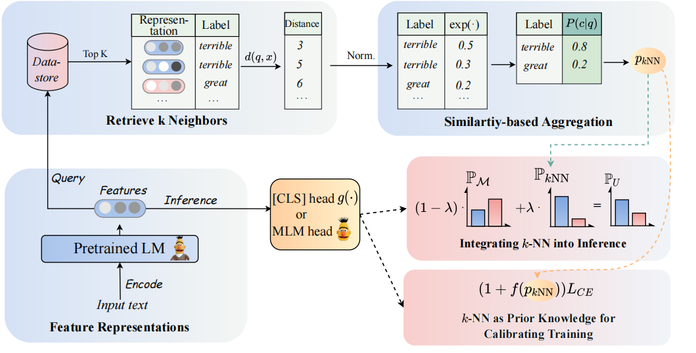

# Revisiting k-NN for Fine-tuning Pre-trained Language Models

Code and datasets for the CCL2023 paper [Revisiting k-NN for Fine-tuning Pre-trained Language Models](https://arxiv.org/pdf/2304.09058.pdf). 

The architecture of our model can be seen as follows:

<div align=center>

</div>

We revisit k-NN classifiers for augmenting the PLMs-based classifiers. Specifically, we propose to adopt k-NN with textual representations of PLMs in two steps:

 (1) Leverage the k-NN as the prior knowledge for calibrating the training process.

 (2) Linearly interpolate the k-NN predicted distribution with that of the classifier of PLMs.

Key to our approach is the introduction of k-NN guided training that regards k-NN predicted probabilities as indications for easy vs. hard examples during training. We conduct extensive experiments on fine-tuning and prompt-tuning, respectively, across 8 diverse end-tasks.

> 📋 Note: There are two main file folders in our project. The folder `GLUE_task` includes six single glue tasks (sst-5, trec, QNLI, MNLI, boolq, cb), the folder `RE_task` includes two information extraction tasks (SemEval, TACREV).

## Requirements

The environmental requirements are placed in `GLUE_task` and `RE_task` respectively.

```setup
pip install -r requirements.txt
```

There are some differences between the environmental requirements of GLUE task and RE task:

- The version of `transformers` in the GLUE task is 4.11.3, while the version of `transformers` in the RE task is 4.7.
- GLUE task based on the `transformers` framework from huggingface , RE task based on the `pytorch_lightning` framework.

## Data Preparation

### 1. GLUE data

We placed the few-shot data of GLUE in `GLUE_task/data/training_data/k_shot` folder. The original full datasets can be download at GLUE website. You can also run following command to generate the few-shot data of GLUE tasks based on the original datasets:

```bash
cd GLUE_task
python tools/generate_k_shot_data.py --k 16 --task SST-2 --seed [13, 42, 100]
```

### 2. RE data

#### 2.1 Initialize the answer words

Use the comand below to get the answer words to use in the training.

```bash
cd RE_task
python get_label_word.py --model_name_or_path roberta-large-uncased  --dataset_name semeval
```

The {answer_words}.pt will be saved in the dataset, you need to assign the model_name_or_path and dataset_name in the get_label_word.py.

#### 2.2 Split few-shot dataset

In the few-shot scenario, we take `k=16` and take 3 different seeds of `1, 2, 3`. The few-shot data will be generated to `dataset/task_name/k-shot`, moreover, you need to copy the validation data, test data and relation data to few-shot data path.

```bash
cd RE_task
python generate_k_shot.py --data_dir ./dataset --k 16 --dataset semeval
cd dataset
cd semeval
cp rel2id.json val.txt test.txt ./k-shot/16-1
```

> Because of the size limitation, we just provide the few-shot data. The full data can be found at their original papers.

## Training

### GLUE Task

The running scipts are placed in `GLUE_task/scripts`. There are multi scripts:

```text
run_exp.sh              # PT / FT: prompt-tuning or fine-tuning without knn.
run_knn_infer_exp.sh    # UNION_infer: pt or ft with knn infer based on the mdoel checkpoints of pt and ft.
run_knn_train_exp.sh    # UNION_all: pt or ft with knn train and knn infer.
run_ssl_exp.sh          # PT / FT in zero-shot setting.
run_ssl_exp_infer.sh    # UNION_infer in zero-shot setting.
run_ssl_exp_train.sh    # UNION_all in zero-shot setting.
```

Just pick one script and run following command:

```bash
cd GLUE_task
bash scripts/run_xxx.sh
```

### RE Task

The running scipts are placed in `RE_task/scripts`. There are also multi scripts like GLUE task:

```text
run_exp.sh              # PT / FT: prompt-tuning or fine-tuning without knn.
run_knn_infer_exp.sh    # UNION_infer: pt or ft with knn infer.
run_knn_train_exp.sh    # UNION_all: pt or ft with knn train and knn infer.
run_ssl_exp.sh          # Zero-shot setting.
```

Just pick one script and run following command:

```bash
cd RE_task
bash scripts/run_xxx.sh
```
# Citation
If you use the code, please cite the following paper:


```bibtex
@article{DBLP:journals/corr/abs-2304-09058,
  author       = {Lei Li and
                  Jing Chen and
                  Bozhong Tian and
                  Ningyu Zhang},
  title        = {Revisiting k-NN for Fine-tuning Pre-trained Language Models},
  journal      = {CoRR},
  volume       = {abs/2304.09058},
  year         = {2023},
  url          = {https://doi.org/10.48550/arXiv.2304.09058},
  doi          = {10.48550/arXiv.2304.09058},
  eprinttype    = {arXiv},
  eprint       = {2304.09058},
  timestamp    = {Tue, 02 May 2023 16:30:12 +0200},
  biburl       = {https://dblp.org/rec/journals/corr/abs-2304-09058.bib},
  bibsource    = {dblp computer science bibliography, https://dblp.org}
}
```
